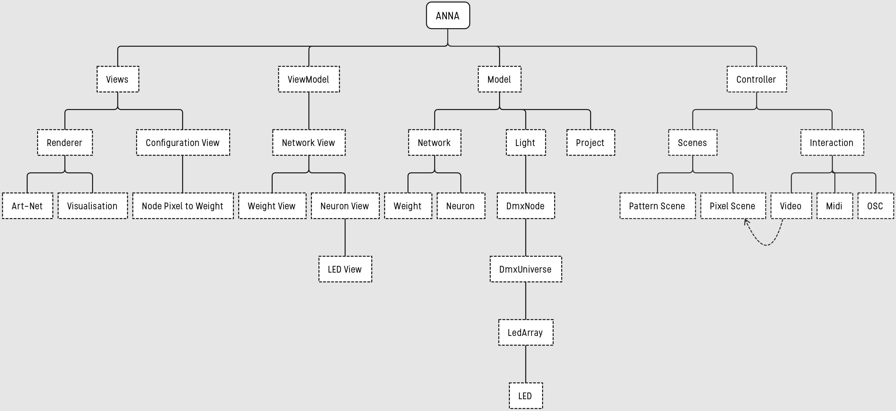

# ANN-A 

The installation is an abstract visualisation of a human neural network, which mirrors the brains thought process and allows the user to grasp the synapses in a person's brain.

*ANN-A at the Château (2018)*

The connections are demonstrated with the use of light. The human brain is a high tech computer, which is able to deal with new impressions and transfer these into fully formed thoughts. With «ANN-A», we turn this flow of chemical reactions into a light projection.

### Architecture

